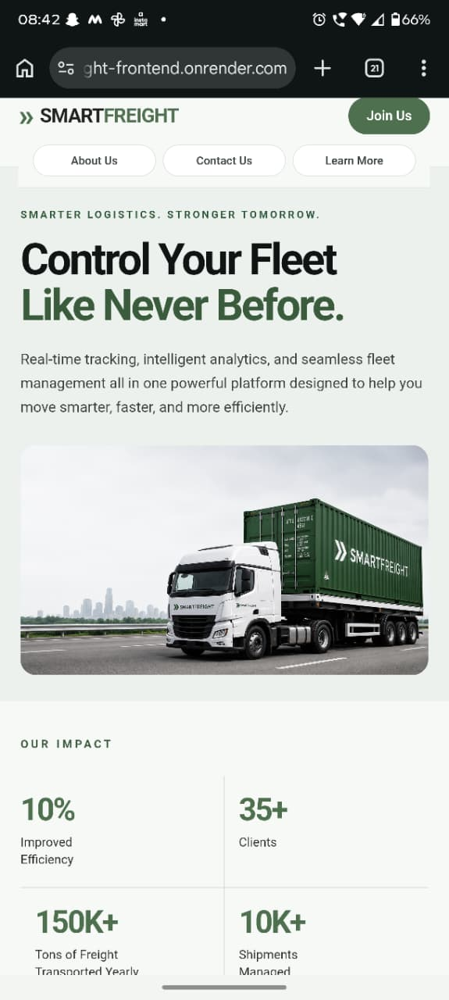
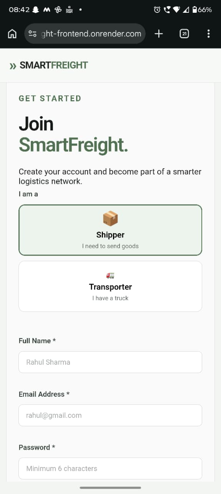
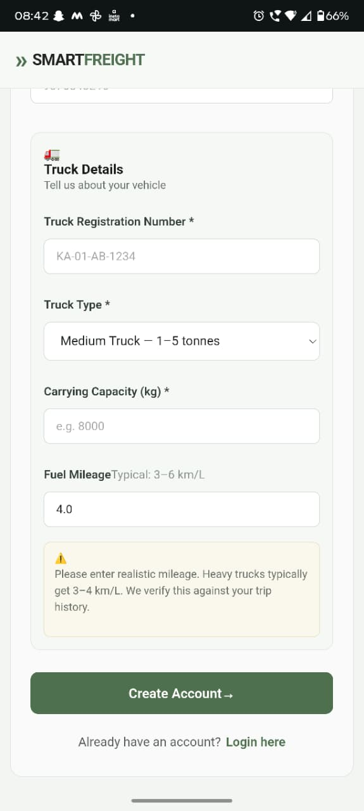
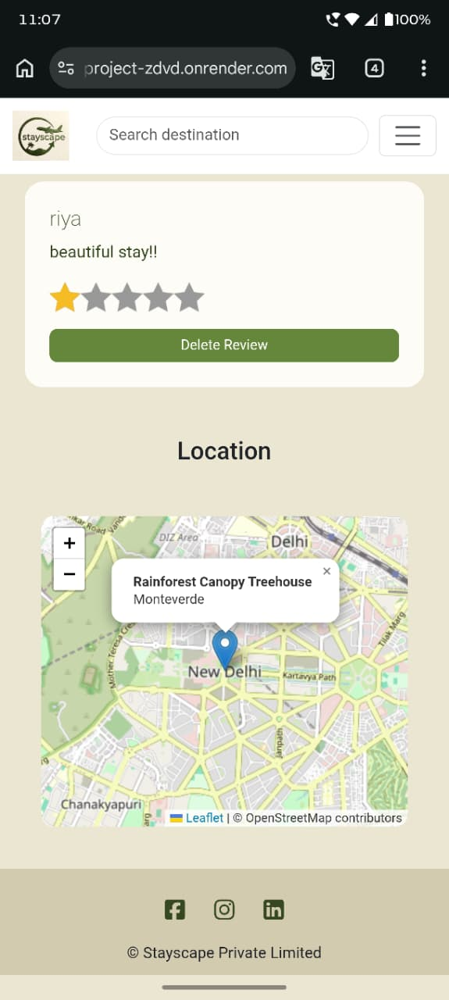
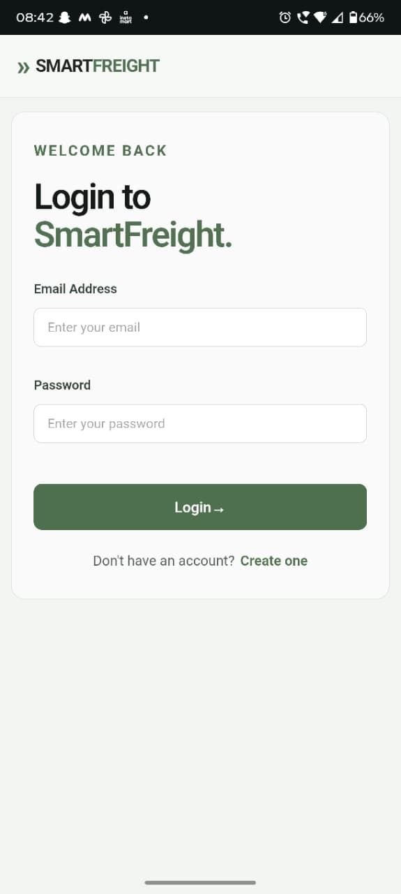
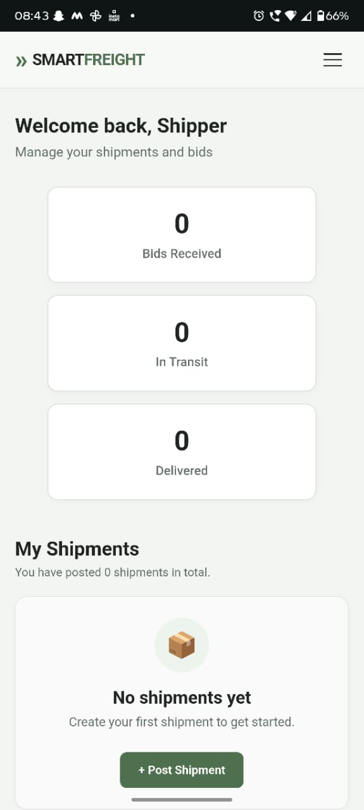
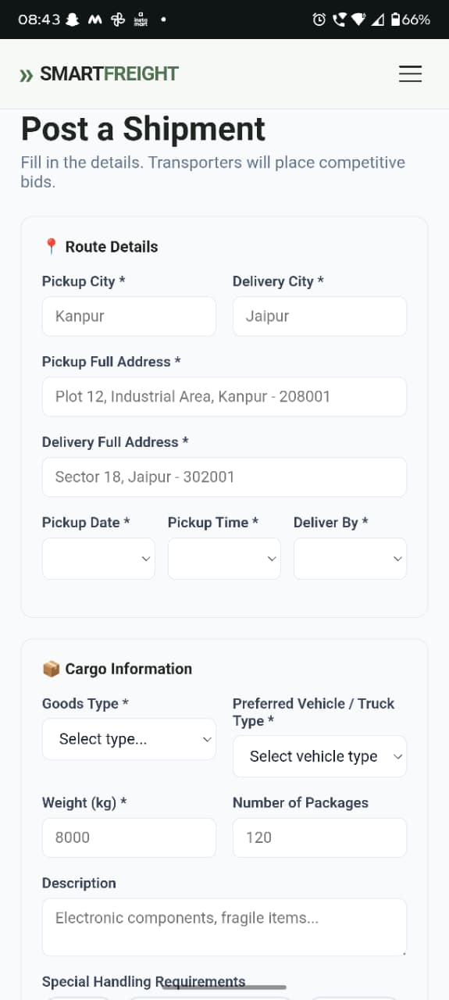
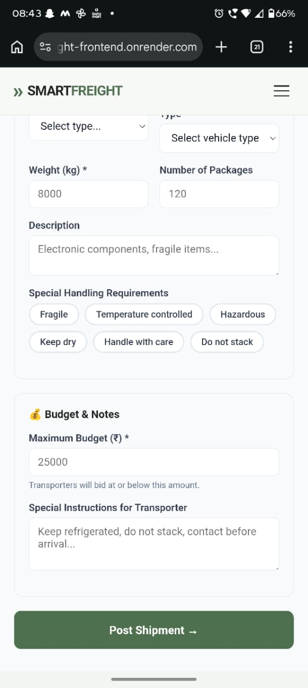

# 🚚 SmartFreight

> A digital freight marketplace connecting shippers and transporters through real-time bidding, cost analysis, and live delivery tracking.

---

## 📌 The Problem

India's freight industry is worth approximately **₹7 lakh crore**.

Yet a large part of the industry still depends on:

- Phone calls
- WhatsApp groups
- Personal contacts
- Manual price negotiation
- Limited shipment visibility

This creates problems for both sides.

**Shippers** have limited price visibility and difficulty finding reliable transporters.

**Transporters** have limited direct access to customers and spend time searching for available loads.

And during transportation, there is often limited visibility into **where the truck actually is**.

### I built SmartFreight to fix that.

---

# 💡 What is SmartFreight?

SmartFreight is a digital freight marketplace that connects **shippers** with **transporters**.

The platform allows:

1. Shippers to post freight requirements.
2. Transporters to discover available shipments.
3. Transporters to place competitive bids.
4. Shippers to compare and accept bids.
5. Transporters to manage assigned deliveries.
6. Shipments to be tracked using live GPS.
7. Shippers to rate transporters after delivery.

### The idea is simple:

**Post → Bid → Select → Transport → Track → Deliver**

Clean. Transparent. Digital.

---

# ⚙️ How It Works — Under the Hood

### 🔐 Role-Based Platform

Shippers and transporters have completely separate dashboards and permissions.

### ⚡ Real-Time Bidding

Bids appear on the shipper's screen instantly without requiring a page refresh using **Socket.IO WebSockets**.

### 💰 Trip Cost Analyzer

Transporters can calculate:

- Fuel cost
- Toll cost
- Driver cost
- Total estimated trip cost

The system also provides **3 bidding strategies** with estimated win probabilities.

### 📍 Live GPS Tracking

Truck location is updated every **10 seconds** through WebSockets and displayed on an interactive **Leaflet map**.

### ⭐ Transporter Ratings

After delivery, the shipper can rate the transporter.

The rating is automatically reflected on the transporter's profile.

---

# ✨ Features

## 🔐 Authentication

- User registration
- User login
- JWT authentication
- Role-based access
- Shipper accounts
- Transporter accounts
- Protected dashboards
- Logout functionality

---

# 🤝 Bidding System

Transporters can place bids on available shipments.

### Shippers can:

- View received bids
- Compare bid amounts
- View transporter information
- Accept bids
- Reject bids
- Track bid status

### Transporters can:

- View placed bids
- Track bid status
- View related shipments
- Manage their deliveries

---

# 🏠 Home Page

The SmartFreight home page introduces the platform and its core purpose.


---

# 📖 About Page

The About page explains the purpose and vision behind SmartFreight.


---

# 📩 Contact Us

Users can contact the SmartFreight team through the contact section.


---

# 📚 Learn More

The Learn More section provides additional information about the SmartFreight platform and its workflow.


---

# 🔑 Login Page

Users can log in using their registered credentials.


---

# 📝 Registration

New users can create an account and select their role.

SmartFreight supports two user roles:

### 📦 Shipper

Shippers create and manage freight shipments.


### 🚛 Transporter

Transporters discover shipments and place competitive bids.


---

# 📦 Shipper Dashboard

The shipper dashboard allows users to:

- View their shipments
- View received bids
- Track shipments
- View delivered shipments
- Cancel posted shipments
- Create new shipments


---

# 🚛 Transporter Dashboard

The transporter dashboard allows users to:

- View available shipments
- Place bids
- View active deliveries
- View completed deliveries
- Track their bids
- View shipment details


---

# ➕ Create Shipment

Shippers can create a new shipment by entering important freight details.

### Shipment information includes:

- From location
- To location
- Weight
- Amount
- Shipment details


---

# 💰 Trip Cost Analyzer

The Trip Cost Analyzer helps transporters understand the actual cost of completing a shipment before placing a bid.

It considers factors such as:

- Fuel
- Toll
- Driver cost
- Total trip cost
- Expected profit

The system also suggests different bidding strategies with estimated winning probabilities.


---

# 🤝 Bids Received

Shippers can view bids placed by transporters and compare different offers.

They can evaluate:

- Bid amount
- Transporter information
- Bid status
- Transporter message


---

# 📍 Delivery Tracking

Once a shipment is assigned to a transporter, its status can be tracked through different stages.

### Delivery flow

```text
Shipment Posted
      ↓
Bid Accepted
      ↓
Pickup
      ↓
In Transit
      ↓
Reached Destination
      ↓
Delivered
```

---

## 🚚 Pickup & Live Tracking

The transporter can start the delivery and the shipment location can be monitored in real time.

Truck location is updated using GPS and displayed on a Leaflet map.


---

## 📍 Reached Destination

The system provides a notification when the transporter reaches the destination.


---

## ✅ Delivery Completed

Once the shipment reaches the destination, the system displays a delivery confirmation.


# 📱 Mobile Interface

SmartFreight is designed to provide a responsive experience across desktop and mobile devices.

The mobile interface adapts the navigation, content sections, dashboards, shipment information, bidding workflows, and tracking experience for smaller screens.

## Mobile Home Page



---

## Mobile Navigation



---

## Mobile About Page



---

## Mobile Contact Page



---

## Mobile Login / Registration



---

## Mobile Dashboard



---

## Mobile Shipment Management



---

## Mobile Delivery Tracking



# 🧑‍💻 Tech Stack

## Frontend

- React.js
- React Router
- JavaScript
- HTML5
- CSS3
- Leaflet.js

## Backend

- Node.js
- Express.js
- Socket.IO

## Database

- PostgreSQL

## Authentication

- JWT
- bcrypt

## APIs & Communication

- Axios
- REST APIs
- WebSockets

## Maps & Tracking

- Leaflet
- OpenStreetMap
- Browser Geolocation API

## Development Tools

- Git
- GitHub
- VS Code
- npm

---

# 🏗️ Architecture

```text
                    ┌──────────────────┐
                    │      User        │
                    └────────┬─────────┘
                             │
                             ▼
                  ┌─────────────────────┐
                  │    React Frontend   │
                  │                     │
                  │  Shipper Dashboard  │
                  │  Transporter Panel  │
                  └──────────┬──────────┘
                             │
                  REST API + WebSockets
                             │
                             ▼
                  ┌─────────────────────┐
                  │   Node + Express    │
                  │                     │
                  │ Authentication      │
                  │ Shipments           │
                  │ Bids                │
                  │ Tracking            │
                  └──────────┬──────────┘
                             │
                             ▼
                  ┌─────────────────────┐
                  │     PostgreSQL      │
                  └─────────────────────┘
```

---

# 🔄 Real-Time Communication

SmartFreight uses **Socket.IO WebSockets** for real-time functionality.

### Real-time features include:

- Instant bid updates
- Live truck location
- Shipment status updates
- Delivery notifications

This removes the need for constant page refreshes.

---

# 🗺️ Live Tracking

The live tracking system uses:

- Browser GPS
- WebSockets
- Leaflet.js
- OpenStreetMap

The transporter location is sent periodically to the server and then broadcast to the relevant users.

This allows the shipper to see the truck's movement on the map.

---

# 🔒 Security

SmartFreight implements:

- JWT-based authentication
- Password hashing using bcrypt
- Protected routes
- Role-based authorization
- Separate shipper/transporter permissions
- Authenticated API requests

---

# 🎯 Why SmartFreight?

Traditional freight operations often depend heavily on personal networks and manual communication.

SmartFreight brings these processes into one platform:

| Traditional Process | SmartFreight |
|---|---|
| Phone calls | Digital platform |
| WhatsApp groups | Centralized marketplace |
| Manual negotiation | Competitive bidding |
| Limited price visibility | Bid comparison |
| Unknown truck location | Live GPS tracking |
| Manual cost calculation | Trip Cost Analyzer |
| Manual updates | Real-time WebSockets |
| Informal feedback | Transporter ratings |

---

# 🚀 Future Improvements

Some possible future improvements include:

- AI-powered route optimization
- Automated transporter matching
- Advanced fraud detection
- Predictive delivery time
- Mobile application
- Digital payment integration
- Multi-truck fleet management
- Advanced analytics dashboard
- Automated invoice generation

---

# 👨‍💻 Project

**SmartFreight** was built to explore how modern web technologies can solve real-world logistics problems by bringing freight discovery, bidding, cost analysis, and delivery tracking into one digital platform.

---

## ⭐ If you found this project interesting

Feel free to explore the repository, try the application, and share your feedback.

**SmartFreight — Making freight simple, transparent, and connected.**